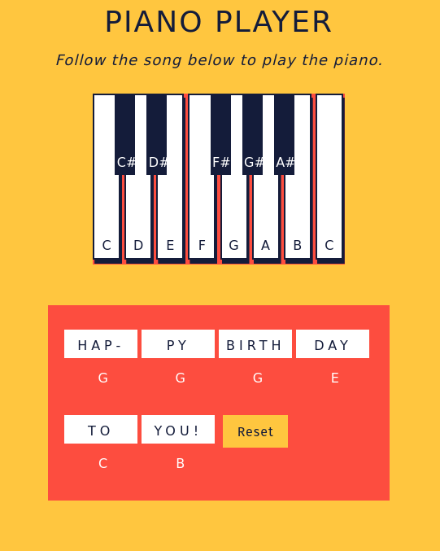

Piano Player is an interactive game used to help beginner-level piano students study. A fictional music education company wants to hire me, a web developer, to creat this game. The HTML file was set up by someone else, but I helped fill in the CSS file, and wrote event handlers using the JavaScript DOM to help make the game come to life. Some of those event handlers were `mouseup`, `mousedown`, and `click`, and used the `.hidden` property of differnt components of the keyboard to make piano keys light up as you press them. The game also has a reset button so that after the Happy Birthday song is played through and shows the notes that the student needs to play, it will start all over again.

  

