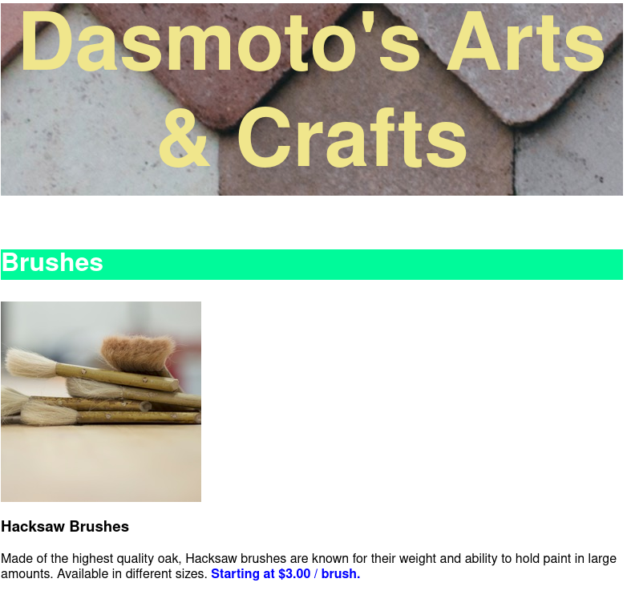
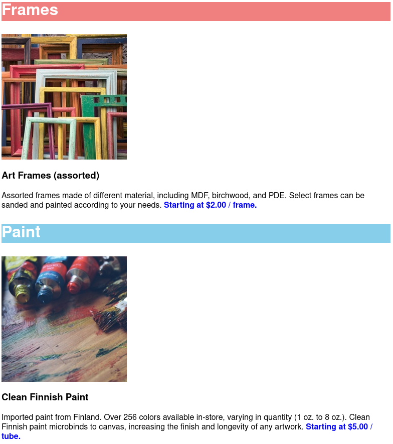

Here, I build a simple website for a fictional arts and crafts store from scratch. I was given the images and the [design spec]('./dasmotos-arts_redline.webp') for how the website was supposed to be designed, much like I imagine it would if I were a freelance web developer.

  

  

