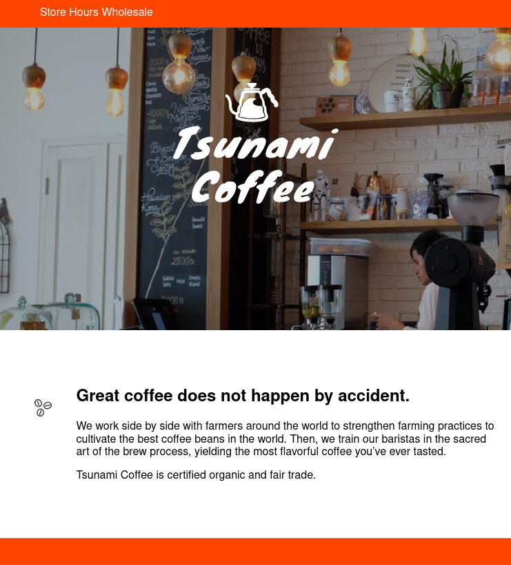

In this project, I helped a fictional coffee shop, "Tsunami Coffee", turn their static website into one that is responsive! This project shows my knowledge of how to use media queries to respond to different screen sizes through the CSS `@media` rule. In addition to updating the website's responsiveness, I also contributed better CSS styles that made the website more visually appealing.

