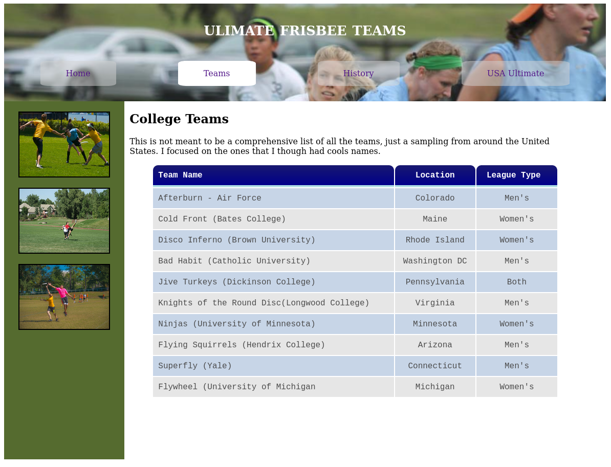

This folder contains the files for the HTML and CSS captsone project. Below is a screenshot of one of the pages of my Ultimate Frisbee website.

  

This project demonstrates how to properly position multiple elements, create a navigation menu and table, and style elements using pseudo-classes.
