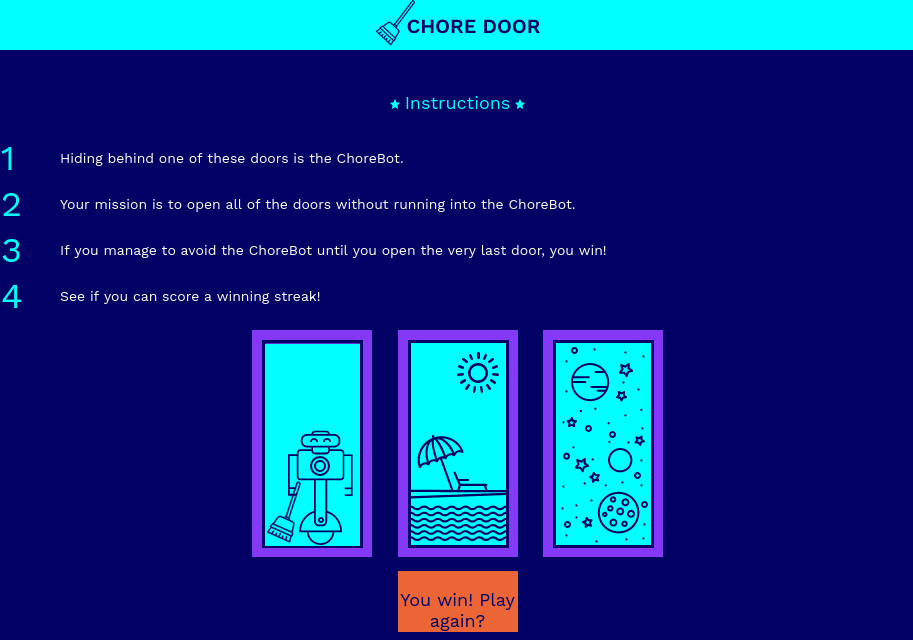

In this Codecademy project, I was tasked with constructing a single-page website that plays a fully-functional game. I wrote all of the code for the HTML, CSS, and JavaScript to produce a dynamic website. This project shows that I can build and style a simple website, but also add JavaScript functionality through scripts and event listeners.

At the start of the game, you will see 3 closed doors.

Your goal is to click through the doors and avoid the robot, which changes position every game. If you make it through the game, you should see something like this:

The game button displays a new message, and you can click the button to restart the game if you want to play again.
